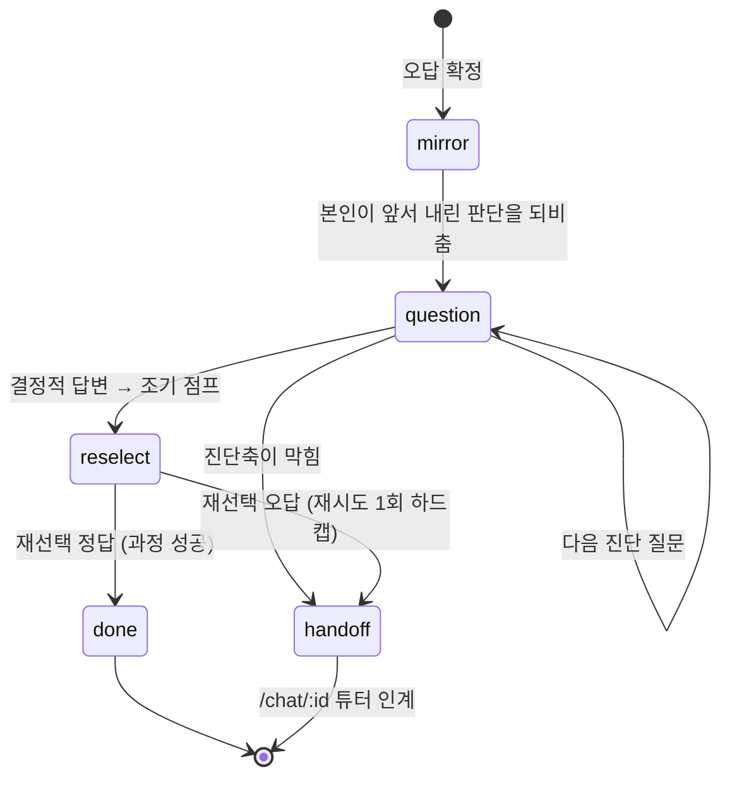

# 수능 영어 독해 튜터

**답을 알려주지 않고, 사고 절차를 밟게 만드는 수능 영어 독해 튜터.**
6개 문제 유형을 유한상태 위저드로 구현하고, 오답은 통일된 회복 루프로 되짚게 한 뒤,
그 튜터 응답이 실제로 좋은지를 LLM-as-Judge + 인간 코딩 일치도로 재는 평가 파이프라인까지 붙였다.

> *A Korean CSAT reading tutor that gates on reasoning, not answers — shipped with the
> rubric, the judge, and the inter-rater agreement math that tell you whether it works.*

React + TypeScript + Vite / Supabase (Auth · Postgres+pgvector · Edge Functions) / FastAPI 포팅 진행 중
Vercel 배포 (SPA rewrite → [`vercel.json`](vercel.json), 배포 절차 [`reports/DEPLOY.md`](reports/DEPLOY.md))

---

## 1. 문제

수능 영어 독해에서 학생이 틀리는 지점은 대개 **어휘가 아니라 절차**다.
지문을 읽기도 전에 선지부터 보고, 답을 고른 뒤에는 왜 그게 답인지 설명하지 못한다.

기존 학습앱은 이 문제를 못 건드린다. 구조가 *"풀기 → 채점 → 해설 공개"* 라서:

- **절차를 건너뛸 수 있다.** 소재를 안 잡아도, 문장 극성을 안 봐도 정답 버튼은 눌린다.
- **오답이 곧 정답 공개다.** 틀린 순간 답이 뜨니 "왜 틀렸는가"를 붙잡을 기회가 사라진다.
- **"왜?"가 객관식이다.** 이유까지 버튼으로 고르면 학생은 메뉴에서 근거를 *고를* 뿐, 만들지 않는다.

그리고 LLM 튜터를 붙였을 때 더 큰 문제가 생긴다. **잘 되는지 잴 방법이 없다.**
"응답이 그럴듯하다"는 인상은 근거가 아니다. 이 저장소는 그 인상을 숫자로 바꾸는 것까지를 범위로 잡았다.

---

## 2. 설계

### 2-1. 6유형 위저드 — 절차를 화면 상태로 강제

빈칸 · 순서 · 어법 · 어휘 · 삽입 · 무관, 6개 유형이 각각 전용 위저드다.
공통 프레임은 [`src/components/solve/wizardFrame.tsx`](src/components/solve/wizardFrame.tsx)의
`useWizard` + 스텝별 `canProceed` 게이트. 유형별로 스텝 내용만 갈아끼운다.

```
[문제 선택] → [사전 독해] → [유형별 분석 스텝] → [선지 처리] →  정답? ─┬─ 예 → [해설]
                  ↑게이트          ↑게이트           ↑근거 한 줄       │
             소재·도입유형을    문장 극성 / 밑줄 범주 /                └─ 아니오 → [회복 루프]
             입력해야 열림      연결사 스캔 …
```

**왜 게이팅인가.** 절차를 "권장"하면 학생은 건너뛴다. `canProceed`가 false면 다음 버튼이
실제로 잠기므로, 소재를 안 적으면 선지 화면 자체를 볼 수 없다.
예: [`OmitWizard.tsx:96-100`](src/components/solve/OmitWizard.tsx) —
소재를 *틀리게* 잡으면 `graded !== 'reject'` 조건에서 잠긴다.

**왜 소재 채점은 대부분 넛지인가.** 무관 유형을 뺀 나머지는 "입력했는가"만 게이트하고
정오답은 흘려보낸다. 소재 판정은 본질적으로 애매해서(“자기조절” vs “자기통제” vs “학습”),
여기서 학생을 막으면 채점기의 오판이 곧 학습 중단이 된다. 막을 값어치가 있는 건
무관 유형처럼 소재 오독이 이후 단계를 통째로 무의미하게 만드는 경우뿐이다.

**왜 "왜?"만 자유서술인가.** 프로젝트에서 `<textarea>`는
[`StepOmitExplain.tsx`](src/components/solve/StepOmitExplain.tsx) 등 *근거 서술* 스텝에만 있다.
선지 정당화 보조에는 버튼을 쓰되([`ReasonButtons.tsx`](src/components/solve/ReasonButtons.tsx)),
그 버튼에는 정답 플래그를 **넘기지 않고** `stableShuffle`로 섞어 위치 단서를 없앤다.
추론의 메커니즘은 메뉴에서 고르는 순간 학생 것이 아니게 되기 때문이다.

### 2-2. 통일 Recovery Loop — 오답에 답을 주지 않는다

오답은 "틀렸습니다 + 정답 공개"로 끝나지 않고 회복 루프로 들어간다.
상태기계는 [`RecoveryLoop.tsx`](src/components/solve/RecoveryLoop.tsx):



세 가지 판단이 들어 있다.

- **왜 mirror가 먼저인가.** 재설명부터 하면 학생의 원래 사고가 덮인다.
  루프는 가르치지 않고, 학생이 *이미 내린* 판단을 먼저 보여준 뒤 그 위에서 되짚는다.
- **왜 재시도 1회 하드캡인가.** 회복 루프를 무한히 돌리면 "찍어서 맞히기"가 된다.
  재선택은 딱 한 번, 틀리면 질문으로 돌아가지 않고 **곧장 튜터 챗으로 인계**한다.
  루프가 학생을 붙잡아두는 게 아니라, 못 풀겠다는 신호를 사람(LLM 튜터)에게 넘기는 구조다.
- **왜 anti-leak를 컴포넌트 경계로 푸는가.** `RecoveryLoop`은 **루브릭을 아예 읽지 않는다.**
  모든 판정이 `grade`/`isCorrect` 클로저로 들어오므로, 렌더 트리에 정답이 존재하지 않는다.
  "정답을 안 그리도록 조심한다"가 아니라 "그릴 데이터가 없다"로 만든 것.
  표시용 루브릭 화이트리스트는 [`rubricDisplay.ts`](src/lib/solve/rubricDisplay.ts).

커버리지: 빈칸·순서·어법·어휘 4유형은 이 통일 컴포넌트를 쓰고,
삽입·무관은 같은 계약(1회 하드캡 · 정답 미공개 · 챗 인계)을 구현한 유형 전용 회복 화면
([`StepInsertRecover.tsx`](src/components/solve/StepInsertRecover.tsx),
[`StepOmitRecover.tsx`](src/components/solve/StepOmitRecover.tsx))을 쓴다.

### 2-3. 3-tier 채점 — LLM은 애매할 때만

```
Tier 1  규칙 그레이더      0토큰 · 결정적 · 클라이언트    src/lib/solve/*.ts (순수함수 33개)
   │    (판정 불가 = ambiguous)
   ▼
Tier 2  루브릭 + LLM 폴백  ambiguous 일 때만 호출          Edge grade-topic / api (FastAPI 포팅)
   │
   ▼
Tier 3  생성형 자기설명    채점 안 함, 약하면 챗 인계       tutor-chat
```

**왜 전부 LLM에 맡기지 않는가.** 세 가지가 동시에 걸린다 —
같은 답에 다른 채점이 나오는 **비결정성**, 스텝마다 붙는 **지연**, 그리고 **비용**.
대부분의 판정(문장 극성, 밑줄 범주, 배열 검증)은 규칙으로 결정적으로 끝나므로
LLM은 *소재 판정이 애매할 때*와 *메커니즘 대화*에만 쓴다.

**왜 실패가 게이트가 아닌가.** 채점 경로의 모든 예외는 `500`이 아니라
`200 + ambiguous`로 떨어진다([`api/routers/grade_topic.py`](api/routers/grade_topic.py)).
소재 채점은 넛지지 관문이 아니라서, 채점기 장애가 학생의 다음 단계를 막으면 안 된다.
이 계약은 [`api/tests/test_grade_topic_router.py`](api/tests/test_grade_topic_router.py)에 테스트로 고정돼 있다.

---

## 3. 평가 — 잘 되는지 어떻게 재는가

만든 튜터가 좋은지를 "응답이 그럴듯하다"로 판단하지 않기 위해, 3단 파이프라인을 별도로 두었다.

```
generate_paired_responses.py   같은 문제에 두 조건(no_rag / rag)으로 응답 생성   → responses.jsonl
        │                       RAG 조건만 교사 전사 발췌를 top-k 리트리벌해 주입
        ▼
judge.py                       12축 루브릭으로 LLM-as-Judge 채점                → judge_scores.csv
        │
        ▼
agreement.py                   judge ↔ 인간 코딩 일치도 (Po / kappa / PABAK)
```

### 3-1. 무엇을 재는가 — 12축 루브릭

[`judge.py`](judge.py)의 `JUDGE_SYSTEM`에 루브릭 원문이 있다.

| 묶음 | 축 | 범위 |
|---|---|---|
| 전략 이행 | GL(전체흐름) · LO(선지한정) · FR(신호어) · EX(사례) · CM(비교) · CF(반사실) | 각 0/1 |
| 품질 | accuracy · depth · pedagogy · actionability | 0~2 / 1~3 / 1~3 / 0~2 |
| RAG 전용 | groundedness · context_relevance | 1~3, **rag 조건에만** |

### 3-2. 누출 통제 — 두 조건이 섞이지 않게

`no_rag` 응답에 RAG 축 점수가 붙으면 두 조건 비교 자체가 무너진다.
`build_user()`는 발췌가 없으면 프롬프트에 *"리트리벌 발췌 없음 (groundedness/context_relevance는 null)"*
을 명시하고, 이 계약은 테스트로 고정돼 있다
([`tests/python/test_judge.py`](tests/python/test_judge.py) `test_no_rag_marks_rag_axes_as_null`).
발췌는 500자로 잘라 한 발췌가 Judge 프롬프트를 잠식하지 않게 한다.

### 3-3. 왜 kappa만 보고하면 안 되는가 — PABAK 병기

[`agreement.py`](agreement.py)는 전략별로 **원일치율 Po · Cohen's kappa · PABAK** 세 개를 함께 낸다.
kappa 하나만 보면 유병률 역설에 걸리기 때문이다. `--self-test`가 이걸 합성 데이터로 재현한다:

```
$ python3 agreement.py --self-test
[역설 예시] Po=0.950 (95% 일치), kappa=0.000, PABAK=0.900
[균형 예시] Po=0.800, kappa=0.600, PABAK=0.600
self-test 통과 ✓
```

20건 중 19건이 일치하는데 kappa는 **0.000**이다. 거의 모든 응답이 그 전략을 썼기 때문에
우연 일치 기대치가 천장을 치고, kappa 분모가 무너진다. 여기서 "일치도 0"이라고 보고하면 틀린 결론이다.
`PABAK = 2·Po − 1`을 병기하면 *"불일치가 실제로 몇 건이었나"*가 그대로 보인다.
양쪽이 전부 같은 값이라 kappa가 정의 불능이면 `None`을 돌려주고 `정의불능`으로 출력한다 —
0으로 뭉개지 않는다.

### 3-4. 현재 상태 — 정직하게

**아직 수집된 평가 수치가 없다.** `reports/`에는 설계 근거 분석
([`app_differentiators.md`](reports/app_differentiators.md), 모든 주장에 `파일:줄번호` 인용)과
배포 문서([`DEPLOY.md`](reports/DEPLOY.md))만 있고, judge 점수표나 kappa 결과는 없다.
파이프라인은 완성이지만 **응답 생성 → 채점 → 인간 코딩** 사이클을 아직 한 바퀴 돌리지 않았다.
그러므로 이 README에는 인용할 수 있는 평가 수치가 없고, **없는 수치를 지어내지 않는다.**

지금 검증 가능한 것은 파이프라인이 **끝까지 돈다**는 사실뿐이고, 그건 직접 확인할 수 있다:

```bash
make eval-smoke     # problems_sample.jsonl → responses → judge(mock) → agreement
```

이 mock 실행이 내는 kappa/PABAK 수치는 **평가 결과가 아니다**(입력 해시로 만든 가짜 점수).
확인되는 것은 열 스키마·CSV 인코딩·`(problem_id, condition)` 키 분리뿐이며,
`judge.py --mock`은 stderr와 `rationale` 열 양쪽에 MOCK 표시를 박아 오인을 막는다.

또 하나 미리 적어둘 한계: **Judge 모델이 생성 모델과 같다**(`claude-sonnet-4-6`).
self-preference 편향 가능성이 있으므로, 실채점 시 다른 모델로 교차 검증하거나
보고서에 한계로 명시해야 한다 ([`judge.py`](judge.py) `JUDGE_MODEL` 주석).

---

## 4. 한계와 배운 것

정직성 제약은 [`reports/app_differentiators.md`](reports/app_differentiators.md) §"과장하면 안 되는 것"에
파일:줄번호 근거와 함께 정리돼 있다. 요점만:

- **학습 효과는 입증된 바 없다.** 위 내용은 전부 *설계·구현* 근거지 성적 향상 증거가 아니다.
  효과성은 애초에 코드로 증명될 수 없다.
- **소재 오독을 실제로 잠그는 건 무관 유형뿐이다.** 나머지 5유형은 "입력했는가"만 게이트한다.
  "모든 유형이 사전독해를 통과해야 진행된다"는 부분적으로만 참이다.
- **anti-leak에 잔여 벡터가 있다.** `correct_order` / `connective_keywords`는 표시 루브릭에서
  제거되지 않는다(`rubricDisplay.ts:35-36`). DOM 실노출 e2e 없이는 "내부필드 노출 0"을 단언할 수 없다.
- **provider 불일치.** 게이트웨이 복귀 전까지 실제 호출 구간은 OpenAI(gpt-4o-mini)다.
  "Claude 단일 모델" 전제는 지금 성립하지 않는다.
- **번들이 크다.** 617.91 kB (gzip 164.41 kB), 코드 스플리팅 미적용.

배운 것 세 가지:

1. **누출은 코드 리뷰가 아니라 타입/컴포넌트 경계로 막는 게 싸다.** "정답을 렌더하지 말 것"이라는
   규칙은 리뷰어가 매번 지켜야 하지만, 컴포넌트에 루브릭을 안 넘기면 지킬 일이 없어진다.
2. **일치도 지표는 하나로 보고하면 거짓말이 된다.** kappa=0.000과 Po=0.950이 같은 데이터에서
   나온다는 걸 self-test로 재현해두지 않았다면, 첫 실채점 때 잘못된 결론을 냈을 것이다.
3. **평가 파이프라인은 API 키 없이도 돌 수 있어야 한다.** 그렇지 않으면 아무도 — 나중의 나를 포함해 —
   그게 도는 코드인지 확인하지 않는다. `--mock`은 그래서 만들었다.

---

## 5. 빠른 시작

### 프론트엔드

```bash
npm install
cp .env.example .env        # VITE_SUPABASE_URL / VITE_SUPABASE_ANON_KEY 채우기
npm run dev                 # http://localhost:5173
```

### 검증 (네트워크·API 키 불필요)

```bash
make test          # lint + build + 파이썬 단위 테스트 72건
make lint          # oxlint
make build         # tsc -b && vite build
make test-py       # 평가 파이프라인 26건 (표준 라이브러리만)
make test-api      # FastAPI 포팅 46건 (api/.venv 필요)
make eval-smoke    # judge → agreement mock 배선 점검
```

### 평가 파이프라인 (실채점 — API 키 필요)

```bash
pip install -r requirements-eval.txt
export ANTHROPIC_API_KEY=...

python3 generate_paired_responses.py \
    --problems problems_sample.jsonl \
    --corpus provided/episodes.jsonl --subchunks provided/subchunks.jsonl \
    --out responses.jsonl
python3 judge.py --responses responses.jsonl --out judge_scores.csv
# judge_scores.csv 와 같은 형식으로 human_codes.csv 를 직접 코딩한 뒤
python3 agreement.py --judge judge_scores.csv --human human_codes.csv
```

> `provided/episodes.jsonl` · `subchunks.jsonl`(교사 전사 코퍼스)는 학생 발화가 섞인 민감 자산이라
> 저장소에 포함되지 않는다(gitignore). 키 없이 배선만 보려면 `--dry-run` 또는 `make eval-smoke`.

### API (FastAPI 포팅 — 진행 중)

```bash
cd api
python3 -m venv .venv && ./.venv/bin/pip install -r requirements.txt
cp .env.example .env
./.venv/bin/uvicorn main:app --reload --port 8000
curl -s localhost:8000/health      # {"status":"ok"}
```

### E2E (배포된 Supabase + 로컬 dev 서버 필요)

```bash
node tests/rls_isolation.mjs             # RLS 격리 — 이 테스트 없이 배포 금지
node tests/recovery_e2e.mjs              # 4유형 회복 루프
node tests/insert_omit_recover_e2e.mjs   # 삽입·무관 회복
node api/tests/parity_grade_topic.mjs    # Edge ↔ FastAPI 응답 동치
```

---

## 6. 프로젝트 구조

```
├── src/                        프론트엔드 (TS/TSX 12,163줄)
│   ├── components/solve/       6유형 위저드 + 스텝 + RecoveryLoop
│   ├── lib/solve/              0토큰 순수 그레이더 33개 (grade*/match* export, 네트워크 호출 0)
│   └── pages/                  ProblemSelect / Solve / Chat
├── supabase/functions/         Edge Functions 3개 (tutor-chat · grade-topic · generate-rubric)
├── api/                        FastAPI 포팅 (grade-topic) — 진행 중, Edge와 병행 운영
│   ├── services/               topic_rule(tier1) · llm(tier2) · supabase_auth
│   └── tests/                  단위 46건 + Edge 대조 parity 테스트
│
├── judge.py                    ★ LLM-as-Judge 채점기 (12축 루브릭, --mock 지원)
├── agreement.py                ★ Po / Cohen's kappa / PABAK — --self-test 로 역설 재현
├── generate_paired_responses.py  RAG vs no-RAG 쌍 응답 생성
├── problems_sample.jsonl       합성 샘플 1문항 (스모크용)
├── rubric_*.txt                유형별 채점키 생성 프롬프트
├── tutor_*.txt                 튜터 시스템 프롬프트 / 유형별 규칙
│
├── tests/python/               평가 파이프라인 단위 테스트 (네트워크 없음)
├── tests/*.mjs                 Playwright e2e + RLS 격리 (라이브 의존)
├── scripts/                    시드(35문항) · eval_smoke.sh
├── reports/                    설계 근거 분석 · 배포 문서
└── Makefile                    단일 검증 진입점
```

---

## 7. 환경 변수

키는 **어떤 파일에도 커밋되지 않는다.** 아래는 이름과 위치만이다.

| 이름 | 어디에 | 용도 |
|---|---|---|
| `VITE_SUPABASE_URL` | 프론트 빌드 env / `.env` | Supabase 엔드포인트 |
| `VITE_SUPABASE_ANON_KEY` | 프론트 빌드 env / `.env` | anon 공개 키. **프론트에 들어가도 되는 유일한 Supabase 키** (RLS로 보호) |
| `LLM_PROVIDER` | Edge secret / `api/.env` | `openai`(기본) 또는 `gateway` |
| `OPENAI_API_KEY` | Edge secret / `api/.env` | Tier-2 폴백 |
| `GATEWAY_API_KEY` | Edge secret / `api/.env` | Tier-2 폴백 (gateway 경로) |
| `ANTHROPIC_API_KEY` | 셸 export만 | `judge.py` · `generate_paired_responses.py` 실채점 |
| `SUPABASE_SERVICE_ROLE_KEY` | 셸 export만 | 시드·RLS 테스트. **`.env`에도 두지 않는다** |

`VITE_` 접두사 변수는 빌드 시 번들에 인라인되므로 anon 키만 넣는다.
`SUPABASE_URL` / `SUPABASE_ANON_KEY` / `SUPABASE_SERVICE_ROLE_KEY`는 Edge 런타임이 자동 주입한다.
전체 목록과 설정 위치는 [`reports/DEPLOY.md`](reports/DEPLOY.md) §1.
